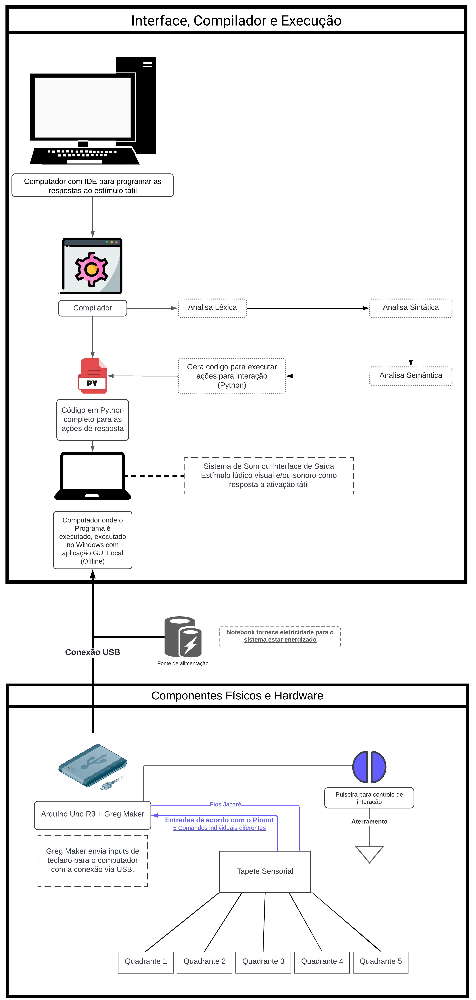

# Arquitetura do Sistema

A estrutura que delineamos a seguir emerge das reflexões e do aprendizado inicial colhido durante o começo do nosso projeto, especificamente nas primeiras duas semanas.

Este diagrama de blocos ilustra os componentes fundamentais e a logística do nosso sistema, o qual foi concebido para habilitar terapeutas ocupacionais a criarem experiências interativas e táteis adaptadas para crianças com Transtorno do Espectro Autista (TEA).

A configuração do hardware detalhada neste esquema captura a essência de nossa abordagem para o mapeamento de interações e as interconexões vitais do sistema de tapete sensorial.

## Diagrama de blocos do hardware do sistema

# Descrição da Arquitetura

## Componentes Físicos, Hardware e Componentes de Software e Funcionalidades

### Tapete Sensorial:
- Composto por cinco quadrantes ativos, cada um com uma textura distinta e um ativador com funcionamento baseado em condutividade por meio do fio de cobre para detecção tátil.
- Os quadrantes funcionam como dispositivos de entrada, que ao serem tocados com a pulseira de aterramento, geram um sinal elétrico detectável.

### Greg Maker + Arduino Uno R3:
- Atua como uma interface de hardware que recebe sinais do tapete sensorial.
- Envia inputs de teclado para o computador, correspondentes a cada quadrante tocado.
- Facilita a programação de ações para interação com os quadrantes do tapete.

### Conexão USB:
- Conecta o Greg Maker ao computador para comunicação de dados e programação.
- Alimentação elétrica para o sistema, proveniente do notebook, é detalhada na legenda como "Fonte de alimentação".

## Interface, Compilador e Execução

### Computador com IDE:
- Onde o terapeuta ou responsável adequado programa as respostas para estímulos táteis usando a IDE personalizada.
- O software de programação permite a criação de um código fonte em uma linguagem adaptada.

### Compilador:
- Transforma o código da linguagem simplificada em Python, passando por análises léxica, sintática e semântica.
- O compilador é representado por um conjunto de blocos que indicam cada etapa do processo de transformação do código.

### Sistema de Som ou Interface de Saída:
- Proporciona um estímulo lúdico (sonoro ou visual) como resposta ao toque nos quadrantes.
- O sistema de saída é detalhado como opcional e responsivo às interações táteis programadas no computador.

## Componentes de Software e Funcionalidades

### IDE Personalizada:
- Permite ao terapeuta ocupacional configurar ações lúdicas associadas aos quadrantes do tapete.
- Componentes de software: Interface gráfica de usuário (GUI) para programação low-code, ambiente de desenvolvimento integrado.

### Linguagem Simplificada:
- Linguagem de programação criada especificamente para este sistema, desenhada para ser intuitiva para não-programadores.
- Funcionalidade: Facilitar a configuração de estímulos e respostas para o tapete sensorial.

### Software de Compilação:
- Converte a programação feita na IDE para um código executável em Python.

#### Funcionalidades:
- Análise Léxica: Processa o texto do código e identifica tokens.
- Análise Sintática: Constrói uma representação estrutural do código.
- Análise Semântica: Verifica a corretude do uso dos elementos do código.

#### Sistema de Saída:
- Executa ações de resposta como sons ou imagens com base na interação da criança com o tapete sensorial.
- Funcionalidades Genéricas: Representação visual ou auditiva correspondente a cada quadrante ativado.