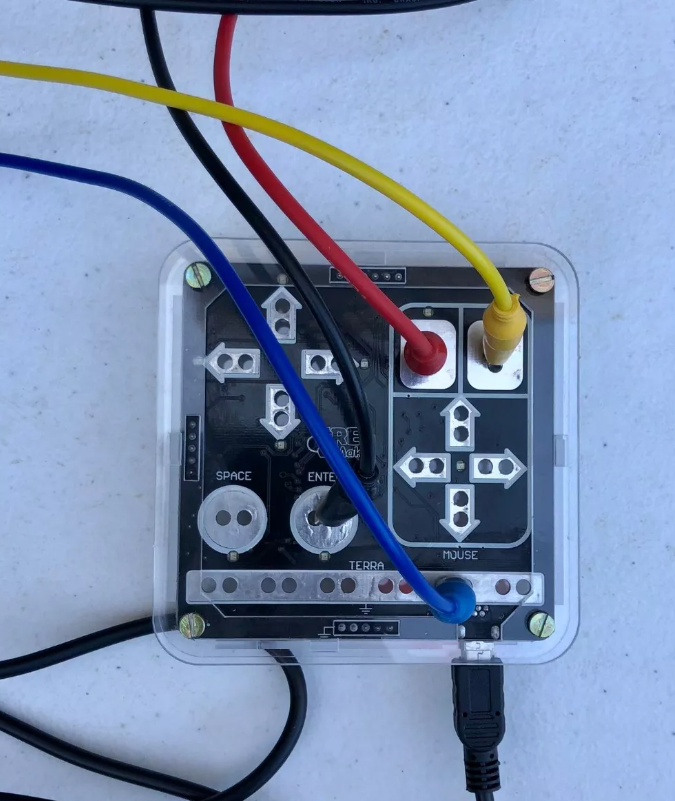
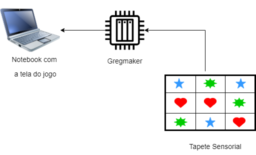
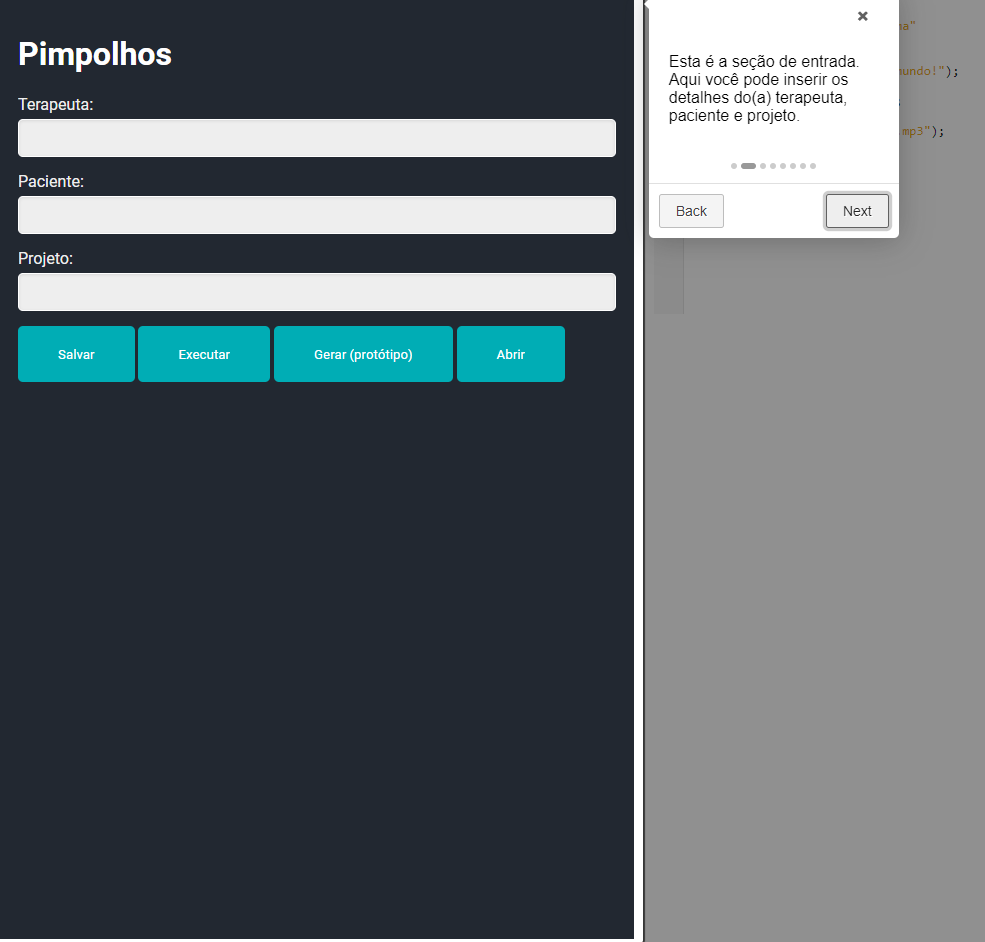
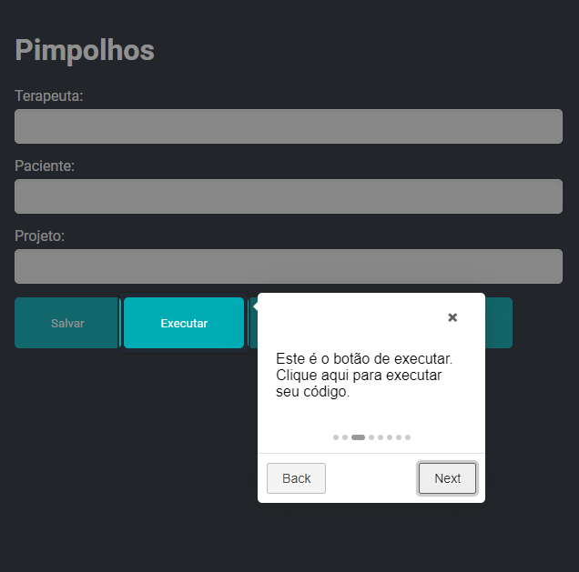
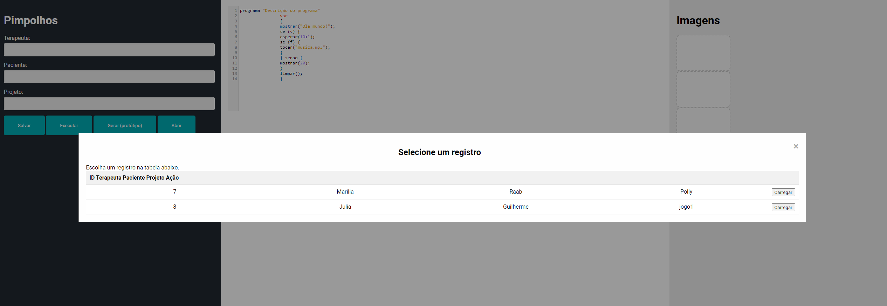

# Desenvolvimento de um Tapete Sensorial Interativo para Crianças com Transtorno do Espectro Autista (TEA)

**Arthur Nisa de Paula¹, Bruno Wasserstein¹, Raab Iane¹, Thomaz Klifson¹ e Vinicius Kumagai¹**

¹Inteli - Instituto de Tecnologia e Liderança, São Paulo, 05508-070, Brasil

## Introdução

As crianças com Transtorno do Espectro Autista (TEA) frequentemente enfrentam desafios significativos em várias áreas do desenvolvimento, incluindo comunicação, interação social e comportamento (American Psychiatric Association, 2022). Diversas intervenções têm sido utilizadas para apoiar essas crianças, como terapias comportamentais, fonoaudiologia, terapia ocupacional e intervenções educacionais (National Autism Center, 2015).

Intervenções que incorporam o uso de tecnologia têm demonstrado potencial em promover melhorias comportamentais e cognitivas em crianças com TEA, apresentando-se como um campo promissor para a pesquisa e prática clínica (Silva, 2020). Exemplos de tecnologias assistivas incluem aplicativos de comunicação aumentativa e alternativa (AAC) (Ganz et al., 2012), dispositivos de reforço positivo (Ferraioli et al., 2011) e sistemas de realidade virtual para treinamento social (Parsons et al., 2011). Essas ferramentas tecnológicas oferecem novas formas de engajamento e aprendizado, tornando-se valiosas no contexto terapêutico para crianças com TEA.

O desenvolvimento de soluções inovadoras, como o projeto do tapete sensorial, visa oferecer uma ferramenta lúdica e educativa que se alinha às necessidades específicas de crianças com TEA. Este projeto explora a interatividade e a sensorialidade como meios de engajamento e aprendizado, seguindo evidências de que a estimulação multi-sensorial pode favorecer a aquisição de habilidades e a expressão emocional nesta população.

O objetivo desta pesquisa é desenvolver e avaliar a eficácia de um tapete sensorial personalizado, que utiliza uma combinação de texturas e estímulos interativos para promover o desenvolvimento sensorial e cognitivo de crianças com TEA. Além disso, o projeto envolve o uso de compiladores e o desenvolvimento de uma IDE, o que representa um diferencial ao permitir a personalização e adaptação dos estímulos de acordo com as necessidades individuais de cada criança. Esta ferramenta inovadora é projetada para ser utilizada em contextos terapêuticos e educacionais, facilitando a implementação de estratégias de intervenção adaptadas às capacidades e interesses de cada criança.

Este trabalho tem potencial para contribuir significativamente para a literatura existente, abordando lacunas no desenvolvimento de recursos terapêuticos acessíveis e eficazes para o TEA. Além disso, espera-se que os resultados deste estudo ofereçam insights práticos para terapeutas, educadores e cuidadores, promovendo uma abordagem mais integrada e personalizada no tratamento e na educação de crianças com TEA.

## Materiais e Métodos

O projeto desenvolvido em parceria com o Curso de Terapia Ocupacional do Departamento de Fisioterapia, Fonoaudiologia e Terapia Ocupacional (FOFITO) da FMUSP visa oferecer um recurso inovador e de baixo custo para o cuidado de crianças com suspeita ou diagnóstico do Transtorno do Espectro Autista (TEA). O tapete sensorial foi projetado para proporcionar métodos diversos de estimulação motora e cognitiva, promovendo intervenções inovadoras e experiências interdisciplinares para os alunos envolvidos e para o Laboratório de Estudos sobre Infância e Adolescência (LEIA).

Para modularizar os estímulos sensoriais e promover uma terapia personalizada, desenvolvemos uma IDE (Ambiente de Desenvolvimento Integrado) específica para a construção de atividades lúdicas nas sessões terapêuticas. A programação não faz parte da formação padrão dos terapeutas ocupacionais, então criamos uma linguagem de programação simplificada e específica para essa aplicação, focando em desafios de acessibilidade para tornar a aplicação intuitiva. A IDE permite que terapeutas ocupacionais programem brincadeiras de forma eficaz e intuitiva.

A IDE inclui um compilador composto por várias etapas: um analisador léxico, um analisador sintático, uma árvore sintática, um analisador semântico e um gerador de código. Essas etapas garantem que os comandos escritos pelos terapeutas sejam precisos e livres de erros, resultando em uma experiência de programação simplificada. O analisador léxico lê os comandos digitados e divide o texto em tokens, como palavras-chave e símbolos. O analisador sintático verifica se a sequência de tokens está correta de acordo com a gramática definida, construindo uma árvore sintática hierárquica. O analisador semântico verifica se os comandos fazem sentido lógico, verificando tipos de dados e contextos. O gerador de código transforma a árvore sintática em instruções executáveis.

Com essa ferramenta, a terapeuta pode personalizar a experiência da criança, decidindo quais elementos farão parte da interação, como som, imagens exibidas e quadrantes do tapete a serem tocados. Essa personalização permite adaptar as atividades às necessidades específicas de cada criança, proporcionando uma experiência lúdica e educativa sob medida.

Para integrar a IDE às interações físicas durante as sessões, utilizamos um tapete sensorial feito de EVA, um material seguro e acessível, que utiliza capacitores para detectar o impacto das crianças nos quadrantes correspondentes. Cada quadrante é decorado com figuras geométricas e cores diferentes, estimulando o desenvolvimento cognitivo das crianças com TEA.

Comparado ao tapete anterior, que usava fios de cobre para a transmissão de sinais (o que era perigoso para as crianças) e exigia o uso de uma pulseira anti-estática (limitando o movimento das crianças), o novo tapete representa uma solução mais segura e acessível. Ele oferece uma interface intuitiva para as crianças com TEA, promovendo um ambiente de aprendizado e terapia mais inclusivo.

A comunicação entre a IDE e o tapete é facilitada pelo dispositivo Greg Maker, que transmite os sinais dos capacitores do tapete para o computador. Esses sinais são processados pela IDE, permitindo que os terapeutas programem e personalizem as brincadeiras conforme as necessidades das crianças. O Greg Maker atua como um intermediário eficiente, garantindo que as interações físicas no tapete sejam corretamente interpretadas e utilizadas pela IDE.

  
  
<em>Figura 1 - Greg Maker.</em>

  
  
<em>Figura 2 - Diagrama da Comunicação entre os Dispositivos.</em>

Este sistema integrado de tapete sensorial, IDE e Greg Maker representa uma abordagem inovadora e eficaz para a terapia ocupacional de crianças com TEA, proporcionando uma experiência de aprendizado e desenvolvimento personalizada e segura.

## Trabalhos relacionados

No campo das tecnologias assistivas para crianças com Transtorno do Espectro Autista (TEA), várias pesquisas têm demonstrado a importância e a eficácia dessas tecnologias no suporte ao desenvolvimento das funções executivas e na melhoria das habilidades cognitivas e sociais.

Com base nos resultados apresentados por (Desideri et al. 2020), é evidente que as Tecnologias da Informação e Comunicação (TIC) oferecem uma abordagem promissora para auxiliar no desenvolvimento das funções executivas em crianças com TEA. A abordagem computadorizada utilizada no artigo envolve o uso de tecnologias assistivas para cognição (ATC), incluindo dispositivos móveis como smartphones e tablets, bem como tecnologias contextualmente conscientes que fornecem suporte contínuo e relevante ao contexto do usuário. Essas tecnologias são aplicadas para lidar com deficiências em áreas como memória de trabalho, gerenciamento de tempo, planejamento, organização e automonitoramento.

Os resultados indicam que as ATCs podem ser eficazes na compensação de dificuldades específicas relacionadas às funções executivas, particularmente no insight (automonitoramento). No entanto, há lacunas significativas na pesquisa, incluindo a necessidade de estudos mais rigorosos que envolvam uma gama mais ampla de habilidades relacionadas às funções executivas, participantes mais velhos e contextos diversos, como ambientes de trabalho. Os autores identificaram que as TIC, incluindo abordagens computadorizadas, podem criar ambientes controláveis e previsíveis, como jogos, proporcionando estimulação multissensorial, principalmente visual. Este contexto se alinha perfeitamente com o projeto proposto de desenvolver um tapete sensorial interativo conectado a um computador.

(Mohd et al. 2020) destacam os benefícios da aprendizagem baseada em jogos para crianças autistas, especificamente no contexto da aprendizagem de matemática. Embora o foco deste estudo esteja na área da matemática, os insights derivados podem ser aplicados de forma relevante ao projeto do tapete sensorial para crianças com TEA. A pesquisa indica que tecnologias associadas ajudam crianças, especialmente com TEA, a desenvolver autocontrole e trabalho independente, fortalecendo habilidades cruciais de autogestão. Além disso, o jogo proposto no artigo visa tornar o processo de aprendizagem mais acessível e atraente para crianças autistas. Da mesma forma, o projeto do tapete sensorial pode fornecer uma estrutura clara e visualmente estimulante para as crianças com TEA, facilitando a compreensão e a participação ativa durante as sessões terapêuticas.

Com base no artigo por (Shahmoradi et al. 2022), que destaca a eficácia dos jogos baseados em computador na melhoria das habilidades cognitivas e sociais em crianças com TEA, é evidente que a integração de tecnologia ao projeto do tapete sensorial pode ser altamente benéfica. Os jogos computadorizados têm sido demonstrados como mais envolventes do que os exercícios rotineiros, oferecendo motivações do mundo real. Além disso, o artigo identificou e categorizou *serious games* ("jogos sérios" em tradução literal do inglês) utilizados para reabilitação da atenção, demonstrando um efeito positivo sobre essa habilidade fundamental. No contexto do projeto do tapete sensorial, essa evidência respalda a ideia de que a integração de elementos tecnológicos, como a associação de toques no tapete a imagens no computador, pode proporcionar uma experiência mais imersiva e eficaz para as crianças com TEA. Ao personalizar as imagens de acordo com as preferências de cada paciente, como proposto no projeto, e utilizando o tapete como uma forma lúdica de interação antes das sessões de terapia ocupacional, é possível criar um ambiente acolhedor e estimulante que contribui para o desenvolvimento cognitivo e social dessas crianças.

Em suma, o projeto apresentado neste artigo se destaca por sua integração única entre tecnologia e terapia ocupacional, oferecendo uma abordagem personalizada que vai além dos estudos convencionais. Em comparação com outros estudos, o tapete sensorial proporciona uma estimulação mais holística, adaptada às necessidades individuais das crianças com TEA, enquanto oferece uma experiência sensorial e interativa. Um diferencial importante do nosso trabalho é a utilização de uma IDE para apoiar terapeutas ocupacionais, o que não é abordado nos trabalhos relacionados. Isso dará mais autonomia aos terapeutas no dia a dia, permitindo personalizar e adaptar os estímulos de acordo com as necessidades específicas de cada criança, e assim, atacando esse gap existente na literatura e na prática clínica. A interação física e digital simultânea do tapete sensorial proporciona uma experiência mais envolvente e imersiva para as crianças com TEA em comparação com os jogos baseados apenas em computador.

## Resultados

### Contexto e Participantes

As participantes desse estudo foram alunas do Curso de Terapia Ocupacional do Departamento de Fisioterapia, Fonoaudiologia e Terapia Ocupacional (FOFITO) da FMUSP. Elas foram convidadas a testar o tapete sensorial e a IDE desenvolvida para criar atividades lúdicas personalizadas para crianças com TEA.

### Avaliação de Usabilidade

1. **Compreensão do tutorial:** O tutorial prático e ordenado foi bem recebido pelas terapeutas ocupacionais. Elas conseguiram seguir as instruções e executar as tarefas sem dificuldades significativas. A avaliação mostrou que o tutorial é intuitivo e lógico, facilitando o aprendizado do uso do sistema.

   

     
     
<em>Figura 1 - Tutorial na segunda etapa.</em>

   

2. **Escrever um código na IDE e executar (com ou sem sucesso do compilador ser executado):** As terapeutas conseguiram escrever códigos na IDE e executar o compilador com sucesso, mesmo que tenha sido necessário fazer pequenas modificações. A mudança do botão "compilar" para "executar" foi uma melhoria significativa. Inicialmente, o termo "compilar" gerou confusão entre as participantes, mas a substituição por "executar" eliminou esse problema, tornando a interface mais acessível e compreensível para terapeutas ocupacionais sem formação em computação.

   

     
     
<em>Figura 2 - Tutorial na terceira etapa.</em>

   

  
3. **Salvar um arquivo com dados necessários:** Durante essa tarefa, as terapeutas ocupacionais preencheram os dados: Nome do(a) terapeuta, Nome do(a) paciente e Nome do projeto. Em seguida, clicaram no botão "Salvar" para verificar se o arquivo era salvo corretamente. Todas completaram a tarefa sem problemas, garantindo a vinculação correta das informações. Essa facilidade de entendimento e rápida compreensão positiva pelas participantes indicou a percepção de que a interface é fácil de usar.

4. **Abrir um arquivo anteriormente salvo:** Todas participantes conseguiram achar e carregar os arquivos salvos sem necessidade de suporte ou repetição do tutorial inicial. Isso reforça a facilidade de uso e a acessibilidade do sistema.   

   

     
     
<em>Figura 3 - Arquivos anteriormente salvos.</em>

   

Todas participantes completaram as tarefas práticas de uso das funcionalidades e entendimento do sistema sem a necessidade de assistência adicional.

## Conclusão

A linguagem FOFI, desenvolvida especificamente para este projeto e usada por todos os grupos, demonstrou ser uma ferramenta poderosa para terapeutas ocupacionais, permitindo a criação de atividades lúdicas sem a necessidade de conhecimentos avançados em programação. A IDE, equipada com um compilador que inclui analisador léxico, sintático, semântico e gerador de código, assegura que os comandos sejam processados corretamente e sem erros. Essa facilidade de uso foi confirmada durante os testes com terapeutas ocupacionais, que conseguiram seguir o tutorial e executar as tarefas com facilidade, destacando a interface intuitiva e prática da ferramenta. Sendo assim, o feedback positivo das participantes indica que a ferramenta tem grande potencial para ser integrada com sucesso nas práticas terapêuticas, facilitando a criação de atividades lúdicas personalizadas e contribuindo para o desenvolvimento das crianças com TEA. Assim, a IDE se apresenta como uma solução viável e valiosa dentro do contexto terapêutico, alinhando tecnologia e acessibilidade em prol de um atendimento mais eficaz e inclusivo.

As funcionalidades de acessibilidade baseadas nas Diretrizes de Acessibilidade para Conteúdo Web (WCAG), como contraste mínimo, títulos de páginas descritivos e gerenciamento de foco para navegação por teclado, facilitaram a visualização e o entendimento das ações programáveis na IDE, aumentando a eficiência no uso da ferramenta.

As aplicações criadas para o tapete sensorial, que respondiam a interações específicas como a exibição de imagens e sons de animais, foram projetadas para serem simples e intuitivas. Isso permitiu que os terapeutas personalizassem facilmente as atividades de acordo com as preferências de cada criança, promovendo uma experiência mais envolvente e interativa.

Comparando a solução desenvolvida com outros trabalhos, como o de Mohd et al. (2020), que se concentraram na criação de jogos específicos para o aprendizado de matemática, o projeto apresentado neste artigo se destaca pela flexibilidade proporcionada pela IDE. Essa plataforma permite que terapeutas personalizem e criem novas interações lúdicas de forma contínua e ajustável, sem a necessidade de novos componentes físicos. A combinação de uma interface acessível e intuitiva com funcionalidades de compilação e execução de códigos personalizados oferece uma ferramenta adaptável às necessidades individuais de cada criança, tornando-se menos repetitiva e mais envolvente a longo prazo.

Para trabalhos futuros, sugere-se a expansão das funcionalidades da IDE, incluindo a integração de novos tipos de sensores e dispositivos interativos, além de estudos longitudinais para avaliar o impacto a longo prazo das atividades personalizadas no desenvolvimento das crianças com TEA. Outra sugestão é a adaptação da ferramenta para diferentes contextos terapêuticos e populações com necessidades especiais diversas, ampliando o alcance e a aplicabilidade da solução desenvolvida.

## Referências

Case-Smith, J., & Arbesman, M. (2008). Evidence-based review of interventions for autism used in or of relevance to occupational therapy. The American Journal of Occupational Therapy, 62(4), 416-429. Acesso em: 2024-05-03.

Desideri, L., Di Santantonio, A., Varrucciu, N., Bonsi, I., & Di Sarro, R. (2020). Assistive technology for cognition to support executive functions in autism: A scoping review. Advances in Neurodevelopmental Disorders, 4(4), 330-343. Acesso em: 2024-05-17.

Maenner, M. J. (2021). Prevalence and characteristics of autism spectrum disorder among children aged 8 years—autism and developmental disabilities monitoring network, 11 sites, United States, 2018. MMWR. Surveillance Summaries, 70. Acesso em: 2024-05-03.

Mohd, C. K. N. C. K., Shahbodin, F., Sedek, M., & Samsudin, M. (2020). Game based learning for autism in learning mathematics. International Journal of Advanced Science and Technology, 29(5), 4684-4691. Acesso em: 2024-05-17.

Shahmoradi, L., Mohammadian, F., & Rahmani Katigari, M. (2022). A systematic review on serious games in attention rehabilitation and their effects. Behavioural Neurology, 2022. Acesso em: 2024-05-17.

Silva, Laiza Ribeiro. Uso da Gamificação e DTT para Melhorar a Aprendizagem e Aumentar o Engajamento de Crianças com Autismo no Contexto da Alfabetização. 2020. Dissertação (Mestrado em Ciências de Computação e Matemática Computacional) - Instituto de Ciências Matemáticas e de Computação, Universidade de São Paulo, São Carlos, 2020. Acesso em: 2024-05-03.

Wainer, A. L., & Ingersoll, B. R. (2015). Increasing access to an ASD imitation intervention via a telehealth parent training program. Journal of autism and developmental disorders, 45, 3877-3890. Acesso em: 2024-05-03.

De Pádua, M.F., & Sanchez, C.N. (2023). AS ALTERAÇÕES CAUSADAS PELA PANDEMIA NO DESENVOLVIMENTO PSICOSSOCIAL E NA ROTINA DE CRIANÇAS AUTISTAS. REVISTA FOCO. Acesso em: 2024-05-18.

Guerra, A. de L. e R., Brasil, M. M., Vasconcelos, E. S., & Santana, E. N. da S. (2024). ENSINO DA MATEMÁTICA PARA ALUNOS COM TRANSTORNO DO ESPECTRO AUTISTA: POSSIBILIDADES DE APRENDIZAGEM. Revista Amor Mundi, 5(1), 3–12. Acesso em: 2024-05-18.

Schmidt, C., Nunes, D.R., Pereira, D.M., Oliveira, V.F., Nuernberg, A.H., & Kubaski, C. (2016). Inclusão escolar e autismo: uma análise da percepção docente e práticas pedagógicas. Psicologica, 18, 222-235. Acesso em: 2024-05-18.

American Psychiatric Association. (2022). Diagnostic and Statistical Manual of Mental Disorders (5th ed., text rev.). American Psychiatric Publishing.
National Autism Center. (2015). National Standards Project, Phase 2. Acesso em: 2024-05-18.

Ganz, J. B., Hong, E. R., & Goodwyn, F. D. (2012). Effectiveness of PECS phase III training for individuals with developmental disabilities and severe communication deficits.Developmental Neurorehabilitation, 15(6), 418-427. Acesso em: 2024-05-18.

Ferraioli, S. J., & Harris, S. L. (2011). The impact of autism on siblings. Social Work in Mental Health, 9(6), 397-416. Acesso em: 2024-05-18.

Parsons, S., & Cobb, S. (2011). State-of-the-art of virtual reality technologies for children on the autism spectrum. European Journal of Special Needs Education, 26(3), 355-366. Acesso em: 2024-05-18.

Silva, S. M. (2020). Tecnologias Assistivas para Crianças com TEA: Avanços e Desafios. Revista de Psicologia Aplicada, 30(2), 123-134. Acesso em: 2024-05-18.

Souza, M. A., Almeida, L. S., & Pereira, R. T. (2018). Tablets e Dispositivos Móveis na Comunicação e Habilidades Sociais de Crianças com TEA. Revista Brasileira de Educação Especial, 24(3), 371-388. Acesso em: 2024-05-18.