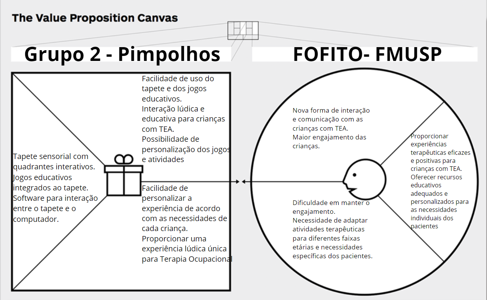
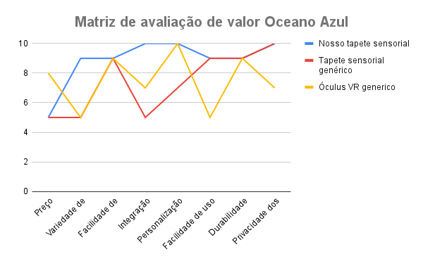
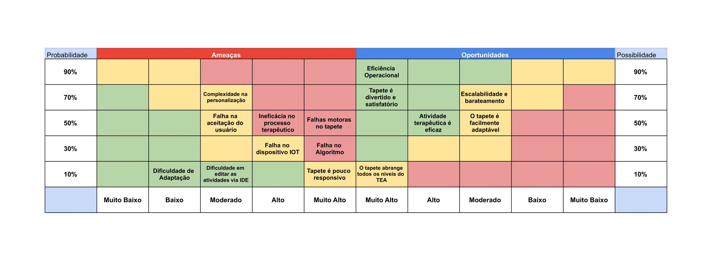

# Sumário

1. [Canvas Proposta de Valor](#canvas-proposta-de-valor)
2. [Total Addressable Market, Service Addressable Market e Service Obtainable Market](#total-addressable-market-service-addressable-market-e-service-obtainable-market)
3. [Matriz de avaliação de valor Oceano Azul](#matriz-de-avaliação-de-valor-oceano-azul)
4. [Matriz de Risco](#matriz-de-risco)
5. [Análise financeira do projeto](#análise-financeira-do-projeto)

# Canvas Proposta de Valor

# Total Addressable Market, Service Addressable Market e Service Obtainable Market

**Definições**

Total Addressable Market (TAM): O TAM representa o tamanho total do mercado que poderia ser atendido se não houvesse restrições em termos de concorrência ou capacidade de entrega.

Service Addressable Market (SAM): O SAM é uma porção do TAM que representa o mercado específico que uma empresa pode segmentar com seus produtos e serviços, levando em consideração fatores como localização geográfica, segmento de clientes, entre outros.

Service Obtainable Market (SOM): O SOM é a parte do SAM que uma empresa pode realistamente adquirir, considerando suas capacidades operacionais, recursos disponíveis e estratégias de entrada no mercado.

**Preço do produto:**

Para determinar o preço do produto, calculamos o custo total da solução (mais detalhes podem ser vistos em [Análise Financeira do Projeto](#análise-financeira-do-projeto)), retirando somente o custo de desenvolvimento de software e aplicamos uma taxa de 20% para o lucro, que sustentará outros custos que não estão sendo considerados e o crescimento e expansão no mercado. Assim, para as análises a seguir, o preço para um cliente adquirir a solução será de R$1.141,20.

**1) Total Addressable Market (TAM):**

Para calcular o TAM, precisamos considerar o número total de terapeutas ocupacionais no mundo. Segundo a World Federation of Occupational Therapists, esse número está próximo de 550.000 terapeutas[[1]].

TAM = 550.000 clientes em potencial * R$1.141,20 = R$627.660.000.

**2) Service Addressable Market (SAM):**

Considerando que tanto a equipe quanto o nosso primeiro cliente estão localizados no Brasil, o SAM será calculado com base no número de terapeutas ocupacionais ativos no país. Segundo a REDE NACIONAL DE ENSINO E PESQUISA EM TERAPIA OCUPACIONAL (RENETO), há 20.000 Terapeutas Ocupacionais em exercício no Brasil[[2]].

SAM = 20.000 clientes em potencial * R$1.141,20 = R$22.824.000,00

**3) Service Obtainable Market (SOM):**

Considerando que o projeto está sendo direcionado para a Faculdade de Medicina da USP, o SOM será calculado com base no número de instituições de ensino similares no Brasil que poderiam se beneficiar do projeto. Segundo dados da RENETO, há 34 cursos de graduação presenciais de Terapia Ocupacional no Brasil[[3]].

Considerando que cada curso necessite de 10 unidades da solução (tanto para fins educacionais quanto para uso imediato em uma unidade do SUS associada à faculdade), podemos calcular o SOM da seguinte maneira:

SOM = 34 cursos * 10 unidades * R$1.141,20 = R$388.008,00

**4) Considerações Finais**

É importante notar que a análise apresentada acima é uma projeção baseada em determinadas premissas e cenários. Embora tenha sido calculada com cuidado, há vários fatores que podem influenciar os resultados finais.

Além disso, outros modelos de negócio também poderiam ser possíveis. Por exemplo, em vez de vender a solução, poderia ser considerado um modelo de negócio baseado em aluguel. Nesse caso, os números apresentados nesta análise poderiam se alterar significativamente, afetando o tamanho do mercado e as projeções de receita.

Portanto, é fundamental realizar uma análise contínua e adaptável, levando em consideração diferentes cenários e estratégias de negócio para garantir uma compreensão abrangente do potencial do mercado e das oportunidades disponíveis.

# Matriz de avaliação de valor Oceano Azul

### Exemplos de como seriam os produtos genéricos mencionados:

**1. Tapete Sensorial Genérico:**
- Este tapete sensorial genérico é feito de materiais básicos, como espuma e tecido simples. Ele pode oferecer uma variedade limitada de texturas e estímulos sensoriais, como cores brilhantes, efeitos sonoros e conexão com outros eletrônicos. No entanto, não é projetado com base em princípios específicos de integração sensorial e pode não oferecer opções de personalização para atender às necessidades individuais das crianças com TEA. A facilidade de limpeza pode ser moderada, mas pode não ser tão durável quanto outras opções no mercado.

**2. Óculos VR Genérico:**
- Este óculos VR genérico oferece uma experiência visual imersiva, mas pode não ser projetado especificamente para crianças com TEA. Pode incluir jogos e aplicativos que oferecem alguma estimulação sensorial, mas pode não ser tão adequado para integração sensorial como um tapete físico. A facilidade de uso pode variar, especialmente para crianças com necessidades especiais. Além disso, a privacidade dos dados pode ser uma preocupação, pois os dispositivos VR podem coletar informações sobre o usuário.

### Justificativa das decisões para cada atributo:

**Preço:** Reduzimos o preço do nosso tapete sensorial para torná-lo mais acessível em comparação com o óculos VR genérico, proporcionando uma opção mais econômica para os clientes sem comprometer a qualidade ou os benefícios terapêuticos, mas ainda parecido com o preço de tapetes genéricos que encontramos no mercado.

**Variedade de estímulos:** Aumentamos a variedade de estímulos oferecidos pelo nosso tapete sensorial em comparação com ambos os concorrentes, tornando-o mais rico e envolvente para as crianças com TEA.

**Facilidade de limpeza:** Nosso tapete sensorial é projetado para ser facilmente limpo e higienizado. Enquanto o Oculus VR pode não ter preocupações de limpeza física, nosso tapete sensorial oferece uma opção prática e segura para ambientes terapêuticos, assim como os tapetes genéricos.

**Integração sensorial:** Criamos nosso tapete sensorial com base em princípios de integração sensorial parecido com os tapetes genéricos, oferecendo uma experiência que estimula múltiplos sentidos, algo que o óculos VR genérico não oferece.

**Personalização:** Criamos a possibilidade de personalização em nosso tapete sensorial, permitindo que os terapeutas adaptem a experiência conforme as necessidades individuais de cada criança. Isso diferencia nosso produto do tapete sensorial genérico, que pode oferecer menos flexibilidade neste aspecto, mas algo que o óculos VR pode proporcionar também.

**Facilidade de uso:** Aumentamos a facilidade de uso do nosso tapete sensorial, tornando-o mais acessível e amigável para as crianças com TEA em comparação com o óculos VR genérico, que pode ser menos intuitivo para essa população.

**Durabilidade:** Nosso tapete sensorial é construído com materiais duráveis e resistentes, garantindo uma vida útil longa e confiável, uma vantagem em comparação com soluções genéricas que podem não ser tão robustas. Embora o Oculus VR possa ser durável em termos de tecnologia, nosso tapete sensorial oferece uma durabilidade física que é crucial para ambientes terapêuticos de uso intenso.

**Privacidade dos dados:** Embora o Oculus VR possa oferecer recursos de privacidade, nosso tapete sensorial é uma opção mais física e tangível, eliminando preocupações potenciais relacionadas à privacidade dos dados digitais.

# Matriz de Risco

Com base nos dados fornecidos, elaboramos as justificativas das decisões tomadas pelo grupo e identificamos maneiras pelas quais o parceiro pode mitigar os riscos analisados:

### Ameaças

**Complexidade na personalização (Moderado - 70%):** Existe o risco de que a personalização do tapete sensorial para atender às necessidades individuais das crianças com TEA possa ser complexa, o que pode atrasar o desenvolvimento do projeto.
- Mitigação: Realizar pesquisas aprofundadas sobre as necessidades específicas das crianças com TEA e envolver terapeutas ocupacionais especializados para orientar a personalização do tapete.

**Falha na aceitação do usuário (Moderado - 50%):** Pode haver resistência ou falta de aceitação por parte das crianças com TEA em relação ao tapete sensorial, o que pode impactar negativamente a eficácia das intervenções terapêuticas.
- Mitigação: Realizar testes piloto com as crianças-alvo e solicitar feedback de terapeutas ocupacionais e familiares para ajustar o design e as atividades do tapete de acordo com as preferências e necessidades das crianças.

**Ineficácia no processo terapêutico (Alto - 50%):** Existe o risco de que o tapete sensorial não atinja os objetivos terapêuticos desejados, resultando em intervenções terapêuticas menos eficazes.
- Mitigação: Realizar avaliações periódicas do progresso das crianças durante as sessões terapêuticas e ajustar as atividades do tapete conforme necessário para garantir que estejam alinhadas com os objetivos terapêuticos.

**Falhas motoras no tapete (Muito Alta - 50%):** O tapete sensorial pode apresentar falhas relacionadas ao funcionamento dos componentes motores, comprometendo sua capacidade de fornecer estímulos sensoriais adequados.
- Mitigação: Realizar testes de qualidade rigorosos durante o processo de fabricação do tapete e implementar medidas de garantia de qualidade para identificar e corrigir precocemente quaisquer falhas nos componentes motores.

**Falha no dispositivo IoT (Alto - 30%):** Se o tapete sensorial depender de dispositivos IoT para funcionalidades adicionais, existe o risco de falha desses dispositivos, afetando a experiência do usuário.
- Mitigação: Escolher dispositivos IoT confiáveis e testados e oferecer suporte técnico adequado para lidar com problemas de conectividade ou funcionamento.

**Falha no Algoritmo (Muito Alto - 30%):** O algoritmo responsável pela personalização das atividades no tapete pode apresentar falhas, prejudicando a eficácia das intervenções terapêuticas.
- Mitigação: Realizar testes extensivos do algoritmo em diferentes cenários e condições para identificar e corrigir possíveis falhas antes do lançamento do produto.

**Dificuldade de Adaptação (Baixo - 10%):** Pode haver dificuldades em adaptar o tapete sensorial para atender às necessidades específicas de algumas crianças com TEA.
- Mitigação: Oferecer treinamento e suporte técnico adequados para terapeutas ocupacionais e cuidadores sobre como personalizar e adaptar o tapete para atender às necessidades individuais das crianças.

**Dificuldade em editar as atividades via IDE (Moderado - 10%):** A interface de desenvolvimento integrado (IDE) utilizada para editar as atividades do tapete pode apresentar dificuldades técnicas ou de usabilidade.
- Mitigação: Realizar treinamento e oferecer suporte técnico para os usuários da IDE, além de realizar melhorias contínuas na interface com base no feedback dos usuários.

**Tapete é pouco responsivo (Muito Alto - 10%):** Existe o risco de que o tapete sensorial tenha uma resposta lenta ou imprecisa aos estímulos, prejudicando a experiência do usuário.
- Mitigação: Realizar testes extensivos de desempenho do tapete para garantir uma resposta rápida e precisa aos estímulos sensoriais, além de implementar atualizações de software conforme necessário para otimizar a responsividade.

### Oportunidades

**Eficiência Operacional (Muito Alto - 90%):** O tapete sensorial pode melhorar a eficiência das intervenções terapêuticas, permitindo que terapeutas ocupacionais atendam a um maior número de crianças com TEA de forma mais eficaz.

**Tapete é divertido e satisfatório (Muito Alto - 70%):** O tapete sensorial pode proporcionar uma experiência divertida e satisfatória para as crianças com TEA, incentivando o engajamento e a participação nas sessões terapêuticas.

**O tapete abrange todos os níveis do TEA (Muito Alto - 10%):** O tapete sensorial pode ser adaptado para atender às necessidades de crianças com diferentes níveis de gravidade do TEA, proporcionando intervenções terapêuticas inclusivas e abrangentes.

**Atividade terapêutica é eficaz (Alto - 50%):** O tapete sensorial pode oferecer atividades terapêuticas eficazes para ajudar no desenvolvimento sensorial, motor e cognitivo das crianças com TEA.

**Escalabilidade e barateamento (Moderado - 70%):** Existe a oportunidade de escalar a produção do tapete sensorial e reduzir os custos de fabricação, tornando-o mais acessível para uma maior quantidade de crianças com TEA.

**O tapete é facilmente adaptável (Moderado - 50%):** O tapete sensorial pode ser facilmente adaptado para atender às necessidades específicas das crianças com TEA, permitindo uma personalização flexível das atividades terapêuticas.

# Análise financeira do projeto

## Custo dos componentes:

Os fretes foram projetados para o endereço do Centro de Saúde Escola Samuel Barnsley Pessoa - CSEB (Av. Vital Brasil, 1490 - Butantã, São Paulo - SP, 05503-000), nosso parceiro neste projeto em desenvolvimento.

|Componente|Quantidade|Valor componente|Valor frete|
|---|---|---|---|
|Greg-Maker |1|R$ 470,00 |R$ 12,00|
|Cabos garra Jacaré-jacaré|Kit com 10 unidades|R$ 15,00 |R$ 8,00|
|Pulseira Anti-estática|1|R$ 20,00 |R$ 16,00|
|Tapete sensorial LDM 18 texturas|1|R$ 350,00 |R$ 60,00|
|Total||R$ 855,00|R$ 96,00|

Portanto, a projeção de investimento que deverá ser feita pelo parceiro para a compra de componentes para a realização do projeto é de R$ 951,00. No que diz respeito à parte digital, supomos que o terapeuta ocupacional já possui um notebook para “rodar” a aplicação, sendo necessário apenas a instalação do software. Se o profissional não possuir um computador, o valor da aquisição desse aparelho deve ser incluído no orçamento.

Considerando que o projeto foi realizado com uma instituição do governo, que não possui fins lucrativos, o custo de desenvolvedores foi feito à parte:

Segundo o site Glassdoor, o salário mensal de um desenvolvedor júnior é de R$ 4.150,00, no dia 18/04/2024. Levando em conta 10 semanas de trabalho, arredondamos para 3 meses de desenvolvimento. Além disso, levamos em consideração o fato de que o projeto contou com a participação de uma equipe de 5 desenvolvedores. Dessa forma, temos o seguinte cenário:

|Profissional|Quantidade|Custo por mês|Quantidade de meses|
|---|---|---|---|
|Desenvolvedor Júnior |5|R$ 4150,00 |3|
 
Por conseguinte, o valor do investimento com profissionais desenvolvedores para esse projeto é de R$12.450,00. Ressalta-se que é uma estimativa. 

## Receita Estimada:

Segundo o site GetNinjas, o preço de uma sessão particular de terapia ocupacional pode variar conforme o tempo de experiência do profissional, a área em que ele atua, entre outros fatores. Mas, basicamente, o valor de uma consulta gira em torno de R$ 67 e R$105. Para aplicação de testes e resgate das atividades rotineiras, o valor pode ser de R$ 135. Portanto, podemos estimar o valor de 100 reais por sessão.

O projeto do tapete sensorial tem o objetivo principalmente de auxiliar o profissional em uma seção de terapia ocupacional para crianças com Transtorno do Espectro Autista (TEA), não sendo o principal responsável pela receita integral de uma seção.

Além disso, cada criança possui características únicas, o que significa que a quantidade de sessões necessárias para cada uma pode variar, dependendo do grau de impacto causado pelo transtorno.

Segundo a resolução COFFITO Nº 444 DE 26/04/2014, a quantidade de pacientes atendidos no período de 6 horas por dia, varia de acordo com o nível de complexidade do atendimento e é definido pelo Responsável Técnico de Fisioterapia. Entretanto, o quantitativo numérico de 6 a 8 pacientes é uma estimativa razoável de atendimentos por dia. Podemos dessa forma, estimar 7 atendimentos por dia para um profissional, o que dá 140 sessões por mês, se multiplicarmos por 20 dias úteis.

Dessa forma, temos o seguinte cenário:
|Fonte da receita|Valor por sessão|Quantidade de meses|Quantidade de sessões por mês|
|---|---|---|---|
|Sessão de terapia ocupacional|R$ 100,00|12|140|

Portanto, a projeção de receita para o período de um ano de um profissional de terapia ocupacional é de 168 mil reais.

# Referências

[1]: https://gitnux.org/occupational-therapy-statistics/#:~:text=Highlights%3A%20Occupational%20Therapy%20Statistics&text=The%20American%20Occupational%20Therapy%20Association,around%20550%2C000%20occupational%20therapists%20globally.

[2]: http://reneto.org.br/formacao-em-to-no-brasil

[3]: http://reneto.org.br/formacao-em-to-no-brasil