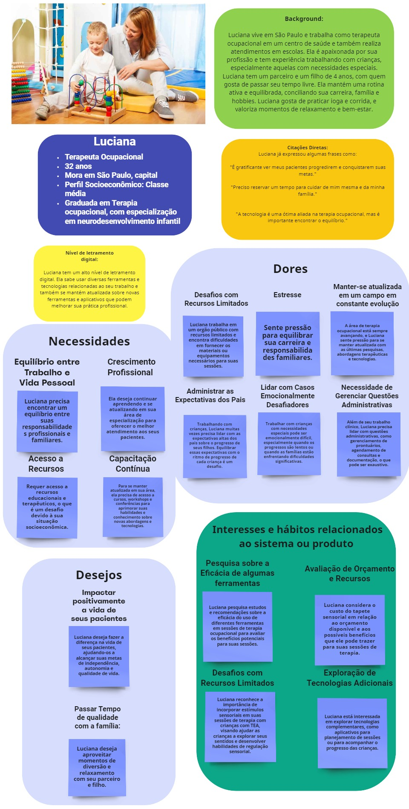

# Sumário

1. [Persona](#persona)
2. [Mapa de Jornada do Usuário](#mapa-de-jornada-do-usuário)
3. [User Stories](#user-stories)

# Persona

As personas foram baseadas em uma pesquisa heurística de caráter exploratório, realizada tanto na visita ao Centro de Saúde Escola Samuel Barnsley Pessoa (CSEB), quanto em uma entrevista individual de validação deste artefato, com as terapeutas responsáveis por este projeto.

Algumas características foram adaptadas de acordo com o feedback das terapeutas, como as citações diretas da persona criança e alguns desejos da mesma.

Também foram utilizadas as referências disponibilizadas pelas terapeutas que estão disponíveis no drive da turma, tais como o artigo "O brincar como mediador na interação com crianças que apresentam transtorno do espectro autista", de Jorge Luís Ferreira Abrão e Gabriela Pires Luchesi, que cita algumas características de crianças com altismo, como dificuldades de comunicação, comportamentos repetitivos, desafios na interação social, sensibilidades sensoriais e alguns interesses específicos (páginas 1 e 4).

Além disso, a terapeuta responsável pelo projeto citou várias vezes que cada criança com TEA é única, dessa forma, procuramos não generalizar as características de uma criança com o espectro altista, optando inclusive por supor que a criança possui a suspeita de TEA, sem um diagnóstico formal, pois a terapeuta comentou durante a nossa pesquisa heurística de caráter exploratório que esse caso é bem comum, apesar de existir uma grande variedade de crianças.

# Mapa de Jornada do Usuário

**Conclusão:** A terapeuta agora possui um dispositivo altamente customizável que permite a ela adaptar as atividades terapêuticas as individualidades de cada criança, além de ser divertido e estimulante.

# User Stories

### User Stories para o(a) Terapeuta Ocupacional

User Story 1: Desenvolvimento do tapete sensorial para crianças com TEA.
- Como terapeuta ocupacional, quero um tapete sensorial para crianças com TEA, para proporcionar estímulos sensoriais e cognitivos durante as sessões terapêuticas.

User Story 2: Adição de elementos visuais interativos ao tapete sensorial.
- Como terapeuta ocupacional, quero elementos visuais interativos no tapete sensorial, para estimular a atenção e a interação das crianças com TEA durante as sessões terapêuticas.

User Story 3: Implementação de atividades motoras no tapete sensorial.
- Como terapeuta ocupacional, quero atividades motoras no tapete sensorial, para promover o desenvolvimento motor das crianças com TEA durante as sessões terapêuticas.

User Story 4: Personalização do tapete sensorial de acordo com as preferências individuais das crianças.
- Como terapeuta ocupacional, quero personalizar o tapete sensorial de acordo com as preferências individuais das crianças com TEA, para aumentar o engajamento e a eficácia das sessões terapêuticas.

User Story 5: Visualização e Edição Simples na IDE.
- Como terapeuta ocupacional, desejo ter uma interface intuitiva na IDE do tapete sensorial que permita visualizar e editar facilmente as atividades terapêuticas, facilitando a customização e adaptação conforme as necessidades individuais das crianças com TEA.

### User Stories para a Criança

User Story 6: Exploração Sensorial Divertida.
- Como uma criança com TEA, quero explorar as diferentes texturas e estímulos sensoriais do tapete sensorial de forma divertida, para me sentir mais confortável e engajado durante a terapia ocupacional.

User Story 7: Expressão Criativa.
- Como uma criança com TEA, quero usar o tapete sensorial como um espaço para expressar minha criatividade e imaginação, através de atividades lúdicas, para me sentir mais confiante e realizado durante a terapia.

User Story 8: Autonomia e Escolha.
- Como uma criança com TEA, quero ter a oportunidade de fazer escolhas dentro das atividades propostas no tapete sensorial, para me sentir mais autônomo e empoderado durante as sessões de terapia ocupacional.

User Story 9: Feedback Visual e Sonoro.
- Como uma criança com TEA, quero receber feedback visual e sonoro imediato ao pressionar um quadrado no tapete sensorial, para entender minhas ações e me envolver na atividade terapêutica de maneira interativa e engajadora.
